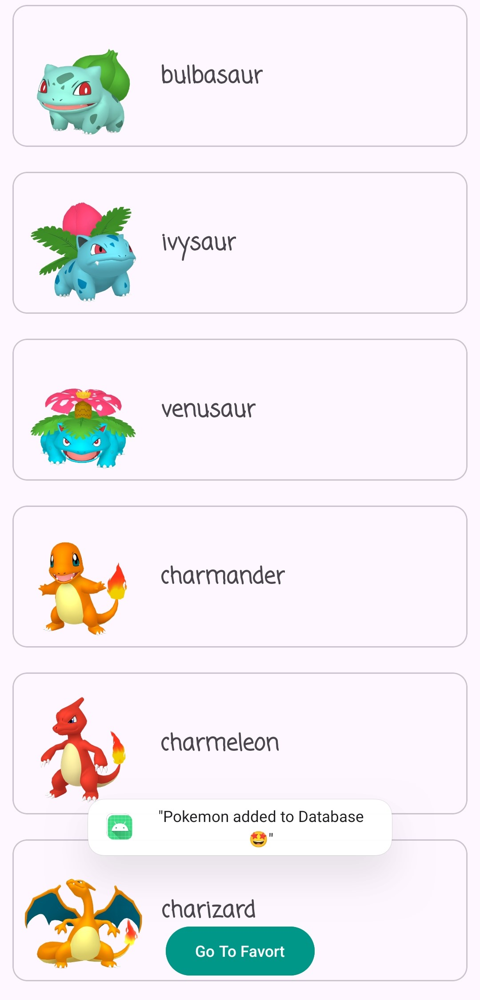
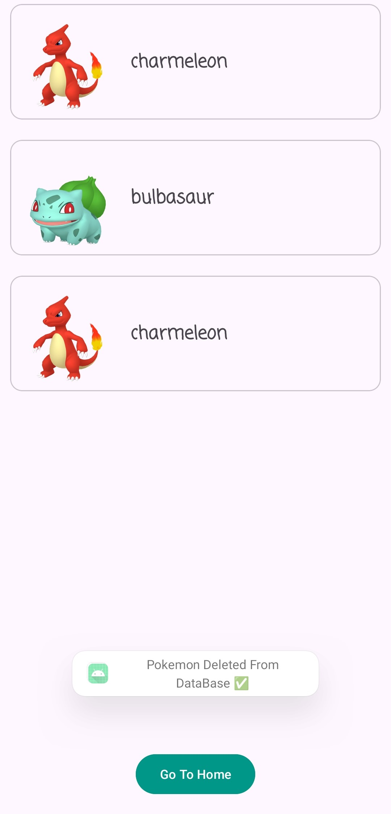
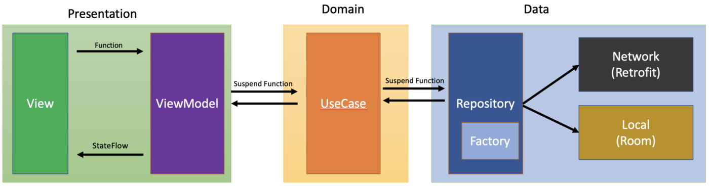

# Pokemon App
Displaying the names and pictures of a group of Pokemon on two screens, the first to retrieve data from the Internet and the second to save the Pokemon you want to save.

## ScreenShots:

  
  

## APK Download
[Click here](https://drive.google.com/file/d/18eSsSlpjTCNI8iTVk04_ycN4cdryvmPK/view?usp=sharing)

## In-App architecture

  

## Tools & APIs
- Clean architecture
- MVVM arch pattern
- RxJava3
- Retrofit
- Room
- Coil
- Dagger Hilt
- Glide
